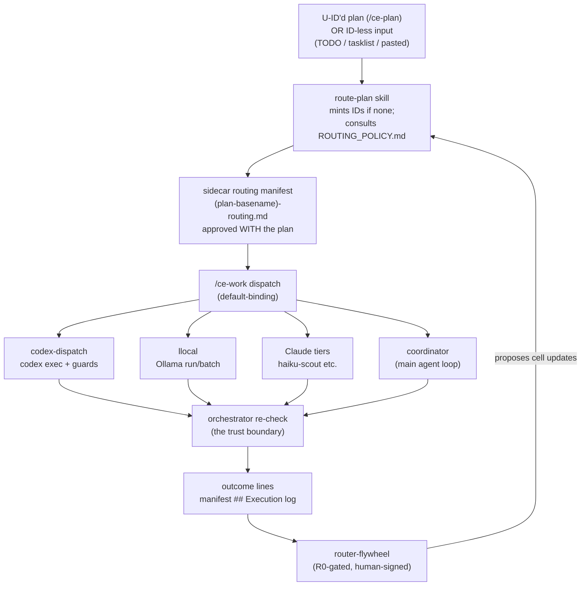

# Architecture

route-sheet is a **plan-time executor-routing layer** for agentic coding. It sits between planning and execution in a plan-execute loop: when a plan is written, every implementation unit gets an executor assignment recorded in a reviewable artifact; when the plan executes, dispatch follows those assignments; when units complete, their outcomes are logged in a canonical grammar; and a gated learning step reads the outcomes back to improve the routing policy.

## The loop



## The executor set

| Executor | What it is | What routes there |
|---|---|---|
| `coordinator` | The main agent loop itself (the model you're talking to) | The **never-delegate set**: architecture/API design, spec-writing-as-the-work, tiny edits, session-scoped tools (MCP/browser/secrets), destructive ops, GitHub mutations, and the verification gate. Also everything with no confident match. |
| `codex-implementer` | OpenAI Codex CLI (`codex exec`), authoring-only | Frozen-spec implementation, mechanical refactors, bugfix-with-known-repro, CI/dep/test-bulk — on credential-clean or dev-grade dirs (see [security-model.md](security-model.md)). |
| `codex-scout` | Codex in read-only mode | Adversarial second-opinion review, huge-context sweeps where an independent model helps. |
| `llocal:<model>` | Local Ollama models via the [`llocal`](../bin/llocal) CLI | Bulk text/JSON extraction, PII-bound batch work, vision/OCR. The model choice lives in [LOCAL_MODELS.md](../templates/LOCAL_MODELS.md). |
| `haiku-scout` | A cheap Claude tier as a read-only subagent | Large-context code reads, "where is X" sweeps. |

Two structural rules shape everything:

1. **Workers author; the coordinator verifies.** Codex and llocal never own "done." Every write-worker's output survives an orchestrator re-check (read the diff, re-run the load-bearing check) before it counts. This is why the credential scrub works at all — a worker that only authors never needs the production credential.
2. **The routing decision is an artifact, not a vibe.** The manifest is reviewed and approved *with the plan*, before any execution. Runtime routers decide per-request, invisibly; here the human sees (and can veto) every assignment up front.

## The sidecar manifest

`route-plan` writes `<plan-basename>-routing.md` next to the plan — never into it (plans stay portable; U-IDs are the stable join key). Shape:

```markdown
# Routing manifest — <plan title>
Plan: <path> · Policy: ROUTING_POLICY.md @ <date>
Mode: gated · Coordinator: <active session model>

## Assignments
- U1 → coordinator [full] — <reason> — load-bearing check: <cmd or n/a>
- U2 → codex-implementer [full] — frozen-spec impl, dev-grade repo — load-bearing check: `pnpm test parser`

## Execution log
U2 · codex-implementer · PASS · re-check `pnpm test parser` green · 0 fix rounds · <session-id> · 2026-07-20
```

A filled example lives at [templates/example-routing-manifest.md](../templates/example-routing-manifest.md). Re-runs **merge, never clobber**: deepening a plan adds assignments for new U-IDs; existing entries and the execution log are preserved verbatim.

**Minting for ID-less input.** When the input has no `### U<N>.` headings — a TODO list, an issue tasklist, a pasted plan — route-plan mints stable `[U<N>]` markers and (behind a consent gate) writes them back into the source, so re-runs stay stable. This is what makes the compound-engineering plugin *recommended, not required*: any structured input is routable. Each assignment carries a **discipline label** — `[full]` (goal + verify command present) or `[bare]` (a thin unit with no verify command). A bare unit can never be assigned to a write-worker, because the orchestrator re-check would have no command to run against it — so weak input produces a visibly hedged manifest, not a confidently delegated one.

**Dispatch is default-binding.** At execution, running a manifest-assigned unit inline without logging an override is treated as a verification-gate miss — deviations go to the manifest execution log plus the policy's drift log (§5) with rationale. The fallback ladder for a missing manifest or unrouted U-ID: work inline, note the gap, offer a route-plan run. Never improvise routing.

**Gate iteration.** When a plan defines a review gate and it produces feedback, the policy's gate-iteration protocol ([routing-policy-spec.md](routing-policy-spec.md) §7) governs the response: feedback is classified against the reviewed unit's own spec — a *correction* (changes how the unit meets its existing goal/files/verify) inherits that unit's routing and rides as fix rounds; an *addition* (new deliverable/goal/surface) requires explicit acceptance and lands as a route-plan mini-pass row or a `## Follow-ons` entry, never riding an existing unit's dispatch. Gate feedback is never self-authorizing: propose → confirm → dispatch, always.

## Lane A vs Lane B

- **Lane B (default): per-unit dispatch** via the [codex-dispatch skill](../skills/codex-dispatch/SKILL.md) — for mixed plans where some units go to Codex and others don't. Pre-flight guards, background `codex exec`, scope check, mandatory re-check.
- **Lane A: whole-plan delegation** (`ce-work-beta delegate:codex`) — only when *every* substantive unit routes to Codex, and only by typed argument. The activation key is never persisted in repo config, because a persisted value would keep delegating while the kill switch is off.

## Kill switch

`touch ~/.claude/.router-off` disables everything. Every skill checks the sentinel and declines; a SessionStart hook ([hooks/router-session-context.py](../hooks/router-session-context.py)) injects the ACTIVE/DISABLED state into every session's context so the standing instructions self-neutralize. Delete the file to re-enable. No config surgery in either direction.

## The flywheel and the R0 gate

The [router-flywheel skill](../skills/router-flywheel/SKILL.md) is the learning step: it joins manifest assignments to execution-log outcome lines on U-ID, tallies per policy cell, and proposes cell updates per the flip thresholds ([routing-policy-spec.md](routing-policy-spec.md) §3). Two humility mechanisms keep it honest:

- **Human-gated state changes.** Count/date increments apply silently; any `❓→✅`, `✅→❌`, or new row requires explicit sign-off.
- **The R0 gate.** Until the routing step has fired *unprompted* on 3 consecutive real, unrelated plans, the flywheel runs dry-run — it reports what it would propose and writes nothing. The system refuses to start learning until it has proven it actually gets used in everyday work. R0 status lives in `~/.claude/ROUTER_STATUS.md` ([template](../templates/ROUTER_STATUS.md)).

## How it hooks into the plan loop

The system rides on plans that carry stable unit IDs (`### U1. <name>` headings). The reference integration is the [compound-engineering plugin](https://github.com/EveryInc/compound-engineering-plugin)'s `/ce-plan` → `/ce-work` → `/ce-compound` pipeline: route-plan fires after `/ce-plan`, dispatch happens inside `/ce-work`, and the flywheel runs at `/ce-compound`. The always-loaded instructions block ([templates/claude-md-router-section.md](../templates/claude-md-router-section.md)) plus the SessionStart hook are what make the firing *unprompted* — the user never has to remember the router exists. Any plan format with stable per-unit IDs could join the same way.
